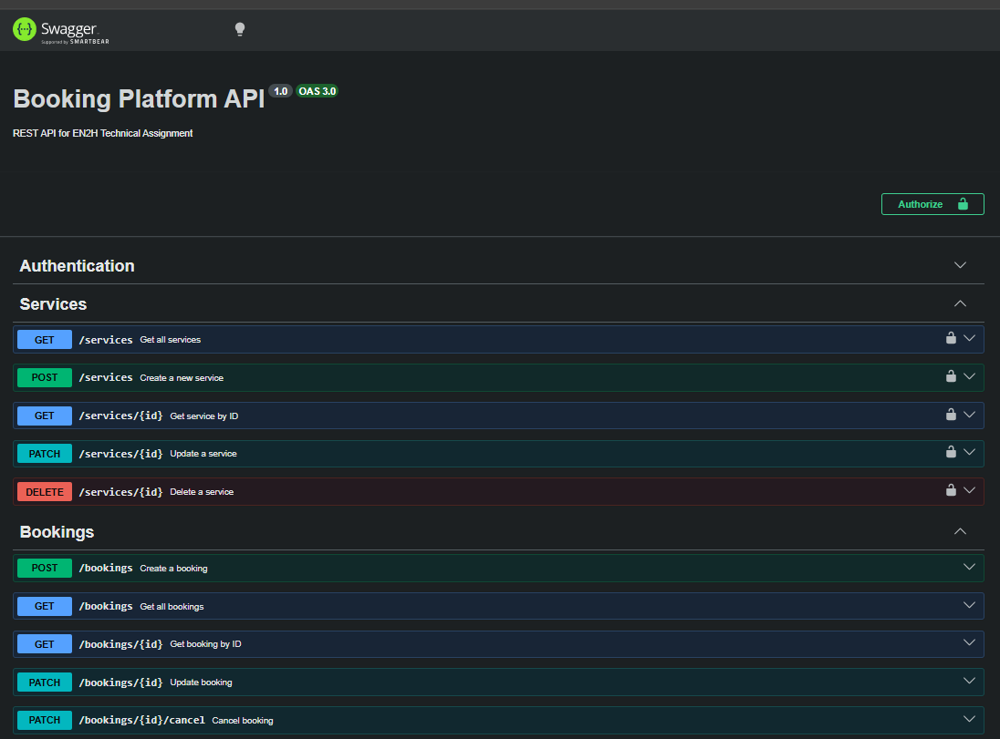

# Booking Platform REST API

A RESTful Booking Platform API developed using **NestJS**, **TypeScript**, **PostgreSQL**, and **TypeORM** as part of the EN2H Software Engineer Intern Technical Assignment.

---

# Project Overview

This project is a RESTful Booking Platform API developed using NestJS, TypeScript, PostgreSQL, and TypeORM. It allows authenticated users to manage services while allowing customers to create and manage bookings through secure REST endpoints. The application follows NestJS best practices and includes JWT authentication, validation, Swagger documentation, and business rule enforcement.

## Authentication

- Register a new user
- Login using email and password
- JWT Authentication
- Password hashing using bcrypt

---

## Service Management

Authenticated users can:

- Create a service
- Get all services
- Get a service by ID
- Update a service
- Delete a service

Service Model

- Title
- Description
- Duration
- Price
- Active Status

---

## Booking Management

Customers can create bookings without authentication.

Supported APIs

- Create Booking
- Get All Bookings
- Get Booking by ID
- Update Booking Status
- Cancel Booking

Booking Model

- Customer Name
- Customer Email
- Customer Phone
- Service
- Booking Date
- Booking Time
- Notes
- Status

Booking Status

- PENDING
- CONFIRMED
- CANCELLED
- COMPLETED

---

# Business Rules

The application implements the following business rules:

- A booking must belong to an existing service.
- Booking dates cannot be in the past.
- Cancelled bookings cannot be marked as completed.
- Duplicate bookings for the same service, date, and time are prevented.
- Bookings cannot be created for inactive services.
- Email addresses must be unique.
- Only authenticated users can manage services.
- Customers can create bookings without authentication.

---

# Technologies Used

- NestJS
- TypeScript
- PostgreSQL
- TypeORM
- JWT Authentication
- Passport JWT
- bcrypt
- Swagger
- class-validator
- Node.js 20+

---

## Main Packages

- @nestjs/swagger
- @nestjs/jwt
- passport-jwt
- bcrypt
- class-validator
- class-transformer

---

# Project Structure

```
src
│
├── auth
├── users
├── services
├── bookings
│
├── app.module.ts
└── main.ts
```

---

# Installation

Clone the repository

```bash
git clone https://github.com/ThimashaThakshali/booking-platform-api.git
```

Open the project

```bash
cd booking-platform-api
```

Install dependencies

```bash
npm install
```

---

# Environment Variables

Create a `.env` file in the project root.

Example:

```env
PORT=3000

DB_HOST=localhost
DB_PORT=5433
DB_USERNAME=postgres
DB_PASSWORD=your_password
DB_DATABASE=booking_platform_db

JWT_SECRET=your_secret_key
JWT_EXPIRES_IN=1d
```

---

# Database Setup

Create a PostgreSQL database named:

```
booking_platform_db
```

The application uses TypeORM with:

```
synchronize: true
```

Tables are automatically created when the application starts.

---

# Database Migrations

This project uses TypeORM with:

```text
synchronize: true
```

Therefore, database tables are created automatically during application startup and no manual migration step is required.

# Running the Application

Development

```bash
npm run start:dev
```

Production Build

```bash
npm run build
npm run start:prod
```

---

# API Documentation

Swagger documentation is available at:

```
http://localhost:3000/api
```

---

# Authentication

Protected endpoints require a JWT Bearer Token.

Example

```
Authorization: Bearer <your_access_token>
```

---

# Assumptions

- One booking occupies a single service time slot.
- Duplicate bookings for the same service, date, and time are not allowed.
- Service availability is controlled using the `isActive` flag.
- Customers do not require an account to create bookings.

---

# Bonus Features Implemented

- JWT Authentication
- Swagger API Documentation
- Request Validation using class-validator
- Global Validation Pipe
- Global Exception Handling
- Duplicate Email Prevention
- Duplicate Booking Prevention
- Booking Search
- Booking Status Filtering
- Pagination
- Inactive Service Validation

---

# Future Improvements

- Refresh Tokens
- Unit Testing
- Docker Support
- Database Migrations
- Role-Based Authorization

---

# Swagger Documentation



---

# Author

**Thimasha Thakshali**

EN2H Software Engineer Intern Technical Assignment
